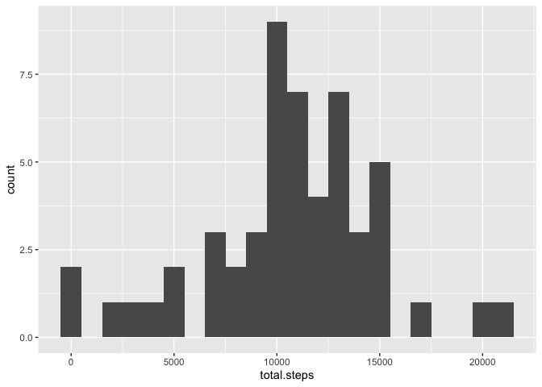
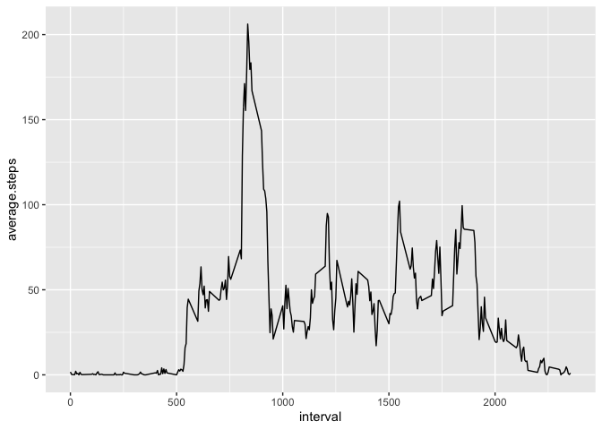
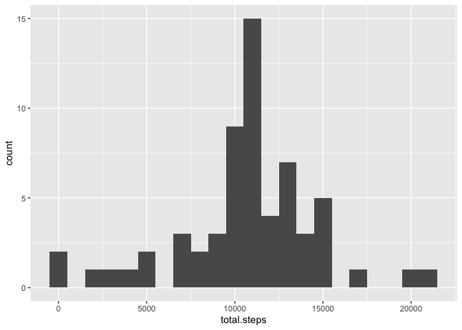
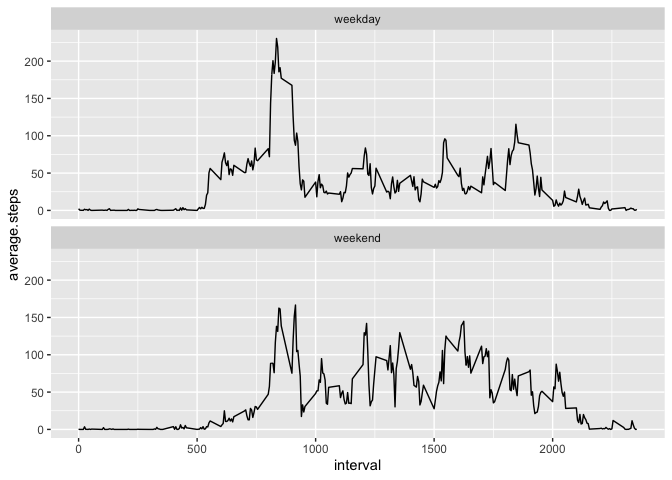

Dependencies:

```r
library(tidyverse)
library(lubridate)
```

## Loading and preprocessing the data


*Load the data (i.e. read.csv())*

Unzip (if not unzipped already) and read the data into a dataframe.


```r
if (!file.exists("./activity.csv")) {
    unzip("./activity.zip")
}
activity <- read.csv("./activity.csv")
```


*Process/transform the data (if necessary) into a format suitable for your analysis*


```r
activity <- mutate(activity, date = ymd(date))
head(activity)
```

```
##   steps       date interval
## 1    NA 2012-10-01        0
## 2    NA 2012-10-01        5
## 3    NA 2012-10-01       10
## 4    NA 2012-10-01       15
## 5    NA 2012-10-01       20
## 6    NA 2012-10-01       25
```

## What is mean total number of steps taken per day?


*Calculate the total number of steps taken per day*


```r
steps.per.day <- activity %>% 
    drop_na(steps) %>% 
    group_by(date) %>% 
    summarise(total.steps = sum(steps), .groups='drop')
head(steps.per.day)
```

```
## # A tibble: 6 x 2
##   date       total.steps
##   <date>           <int>
## 1 2012-10-02         126
## 2 2012-10-03       11352
## 3 2012-10-04       12116
## 4 2012-10-05       13294
## 5 2012-10-06       15420
## 6 2012-10-07       11015
```


*If you do not understand the difference between a histogram and a barplot, research the difference between them. Make a histogram of the total number of steps taken each day*


```r
g <- ggplot(steps.per.day, aes(x=total.steps)) + 
    geom_histogram(binwidth=1000)
g
```

<!-- -->


*Calculate and report the mean and median of the total number of steps taken per day*


```r
mean.steps <- round(mean(steps.per.day$total.steps, na.rm=TRUE), 1)
median.steps <- median(steps.per.day$total.steps, na.rm=TRUE)
```
**mean** of the total number of steps per day is **10766.2**

**median** of the total number of steps per day is **10765**

## What is the average daily activity pattern?


*Make a time series plot (i.e. type = "l") of the 5-minute interval (x-axis) and the average number of steps taken, averaged across all days (y-axis)*

Intervals averaged across all days:

```r
intervals <- activity %>% 
    group_by(interval) %>%
    summarise(average.steps = mean(steps, na.rm=TRUE), .groups='drop')
head(intervals)
```

```
## # A tibble: 6 x 2
##   interval average.steps
##      <int>         <dbl>
## 1        0        1.72  
## 2        5        0.340 
## 3       10        0.132 
## 4       15        0.151 
## 5       20        0.0755
## 6       25        2.09
```


```r
g <- ggplot(intervals, aes(x=interval, y=average.steps)) +
    geom_line()
g
```

<!-- -->


*Which 5-minute interval, on average across all the days in the dataset, contains the maximum number of steps?*


```r
max.interval <- intervals[which.max(intervals$average.steps), ]$interval
```

Answer: Interval number **835**

## Imputing missing values


*Calculate and report the total number of missing values in the dataset (i.e. the total number of rows with NAs)*


```r
num.na <- count(filter(activity, is.na(steps)))
```

Answer: There are **2304** missing values


*Devise a strategy for filling in all of the missing values in the dataset. The strategy does not need to be sophisticated. For example, you could use the mean/median for that day, or the mean for that 5-minute interval, etc.*

Answer: I will use the mean for total steps in that same interval across all days, rounded to zero decimals.


*Create a new dataset that is equal to the original dataset but with the missing data filled in.*

Create copy of data frame, with filled NAs

```r
filled.activity <- data.frame(activity) ## create copy of *activity* data frame
## Statement replaces NA values by mapping them using the "intervals" data frame as a dictionary
filled.activity[is.na(filled.activity$steps), ]$steps <- sapply(filled.activity[is.na(filled.activity$steps), ]$interval, function(i) as.integer(round(intervals[intervals$interval==i, ]$average.steps, 0)))
head(filled.activity)
```

```
##   steps       date interval
## 1     2 2012-10-01        0
## 2     0 2012-10-01        5
## 3     0 2012-10-01       10
## 4     0 2012-10-01       15
## 5     0 2012-10-01       20
## 6     2 2012-10-01       25
```


*Make a histogram of the total number of steps taken each day and Calculate and report the mean and median total number of steps taken per day. Do these values differ from the estimates from the first part of the assignment? What is the impact of imputing missing data on the estimates of the total daily number of steps?*

Histogram of steps taken each day, after filling NA values

```r
filled.steps.per.day <- filled.activity %>% 
    drop_na(steps) %>% 
    group_by(date) %>% 
    summarise(total.steps = sum(steps), .groups='drop')
g <- ggplot(filled.steps.per.day, aes(x=total.steps)) + 
    geom_histogram(binwidth=1000)
g
```

<!-- -->


```r
filled.mean.steps <- round(mean(filled.steps.per.day$total.steps, na.rm=TRUE), 1)
filled.median.steps <- median(filled.steps.per.day$total.steps, na.rm=TRUE)
```
**mean** of the total number of steps per day is **10765.6**

**median** of the total number of steps per day is **10762**

Observation: Although the histograms look very similar, there are minor differences in the mean and median after filling NA values. The mean changed from **10766.2** to **10765.6**, while the median changed from **10765** to **10762**. Impact of **-0.01 %** for the mean and **-0.03 %** for the median.

## Are there differences in activity patterns between weekdays and weekends?


*Create a new factor variable in the dataset with two levels – “weekday” and “weekend” indicating whether a given date is a weekday or weekend day.*

Create function to identify weekends, add the column to the data, and include this new column in the total steps per day calculations.

```r
weekday <- function(d) {
    if(weekdays(d, abbreviate = TRUE) %in% c("Sun", "Sat")) {
        return("weekend")
    } else {
        return("weekday")
    }
}
filled.activity <- mutate(filled.activity, type=as.factor(sapply(date, weekday)))
head(filled.activity)
```

```
##   steps       date interval    type
## 1     2 2012-10-01        0 weekday
## 2     0 2012-10-01        5 weekday
## 3     0 2012-10-01       10 weekday
## 4     0 2012-10-01       15 weekday
## 5     0 2012-10-01       20 weekday
## 6     2 2012-10-01       25 weekday
```

```r
filled.steps.per.day <- mutate(filled.steps.per.day, type=as.factor(sapply(date, weekday)))
head(filled.steps.per.day)
```

```
## # A tibble: 6 x 3
##   date       total.steps type   
##   <date>           <int> <fct>  
## 1 2012-10-01       10762 weekday
## 2 2012-10-02         126 weekday
## 3 2012-10-03       11352 weekday
## 4 2012-10-04       12116 weekday
## 5 2012-10-05       13294 weekday
## 6 2012-10-06       15420 weekend
```


```r
by.weekday <- filled.steps.per.day %>% 
    group_by(type) %>% 
    summarise(mean.steps=mean(total.steps), .groups="drop")
by.weekday
```

```
## # A tibble: 2 x 2
##   type    mean.steps
##   <fct>        <dbl>
## 1 weekday     10255.
## 2 weekend     12201
```


```r
weekday.steps <- by.weekday %>% filter(type=="weekday") %>% select(mean.steps) %>% pull()
weekend.steps <- by.weekday %>% filter(type=="weekend") %>% select(mean.steps) %>% pull()
```

**mean** of the total number of steps per day on weekdays is **10255.3**

**mean** of the total number of steps per day on weekends is **12201.0**

Observation: Average steps per day on weekend compared to average steps per day on weekdays show a difference of **18.97 %**.


*Make a panel plot containing a time series plot (i.e. type = "l") of the 5-minute interval (x-axis) and the average number of steps taken, averaged across all weekday days or weekend days (y-axis). See the README file in the GitHub repository to see an example of what this plot should look like using simulated data.*


```r
weekend.intervals <- filled.activity %>% 
    group_by(interval, type) %>%
    summarise(average.steps = mean(steps, na.rm=TRUE), .groups='drop')
g <- ggplot(weekend.intervals, aes(x=interval, y=average.steps)) +
    geom_line() + 
    facet_wrap(~ type, dir="v")
g
```

<!-- -->


